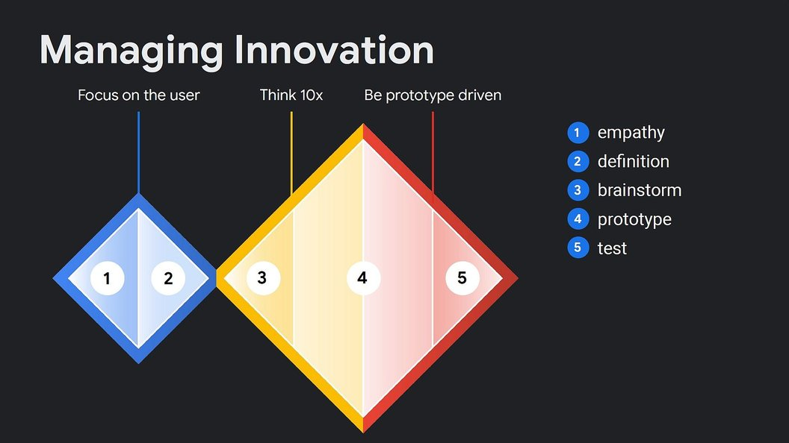

# Architecting and Building the Agentic Marketing System

*Foundational Architecture and Workflows for AI-Assisted Marketing Systems*

> **How to use this document.** Section 1 is the poster - print it, pin it, re-read it before every marketing engagement. Sections 2-3 are the skeleton and the scored inventory - the catalyst you bring to business users so they never face a blank page. The **Size Fit** column in Section 3 and the **Sourcing Cheat Sheet** in Section 3.10 tell you which rows are essential, helpful, or skippable at your scale - whether you are a solo consultant or a global enterprise. Sections 4-5 are the execution model and the non-functional defense. Section 6 lists what was considered and trimmed. Section 7 is a short reflection on how this distillation was made.
>
> **For readers at every size.** This document is intentionally written to be useful from a solo real-estate broker running their own SEO to a global brand with a four-tier marketing organization. See [Marketing-Vendors-By-Category.md](Marketing-Vendors-By-Category.md) for the living vendor and tool companion.

---

## 1. The 7 Commandments

The principles I hold when I walk into any marketing client engagement. Every commandment is a reaction to a real failure mode I've seen or read about - none of them are aspirational.

1. **Empathy before architecture.** Phase 3 (architecture) fails when Phases 1 and 2 (empathy and definition) are skipped. If a stakeholder asks for architecture on day one, my job is to earn the right to answer by doing discovery first - not to draw boxes I'll regret.

2. **Catalyst, not blank page.** Business users don't say "here are my requirements" - they say "show me what you have, and I'll tell you what I want." Always arrive with working sample skills from industry creators (Kieran Flanagan, Rick Mulready, Grace Leung) as ideation catalysts. The blank page is the enemy; a flawed template is a friend.

3. **Co-Create - don't ping-pong.** English is the new programming language, so the business owns the logic in plain text. I own the governance wrapper: API connections, deterministic linters, identity resolution, evaluations. The waterfall-era handoff is gone; what replaces it is a two-lane highway, not a conveyor belt.

4. **Decouple logic from platform.** The Agentic Skill (plus MCP for connectivity) is the portable unit. The same skill must be able to run on Claude Enterprise, Databricks Mosaic AI, or Azure AI Foundry without rewriting a line of business logic. Vendor lock-in is a tax on tomorrow's flexibility.

5. **Augment, don't replace.** Agents produce drafts; humans review and approve anything that changes state. The goal is bigger LEGO pieces for people to inspect, not a dehumanized pipeline. If a proposed agent workflow removes the human from the loop, redesign it.

6. **Default-deny MCP writes.** Model Context Protocol servers are read-only by default. Write access requires a granular permission model, explicit authorization, and testing. A hallucinating agent that can only propose drafts is a feature; a hallucinating agent that can publish or delete is a liability.

7. **Observability is Day 1, not Day 2.** Non-deterministic tool use and self-mutating instructions require native telemetry from the moment a skill ships. If the chosen execution platform doesn't have guardrails, evals, and tracing built in (as Databricks Mosaic AI and Anthropic Enterprise do), pick a different platform.

---

## 2. The Marketing X-Ray: 8 Universal Verbs

The bones. Every big marketing organization performs these eight activities regardless of B2B/B2C, product category, or whether AI exists. Think of them as the axioms - the "addition, subtraction, multiplication, division" of the discipline - that underlie every specific use case in Section 3.

Every activity in this document serves the same underlying sequence: prospects must first become **aware** you exist, then develop **affinity** for what you stand for, then build enough **trust** to transact. A one-person consultancy and a global corporation run the same chain; only the instrumentation, budget, and governance change. The 8 verbs below are the cycle that moves prospects through awareness → affinity → trust → transaction at any scale.

### 2.1 SENSE: Watch the water for signals

Every marketing cycle begins with monitoring what's moving in the market: trending topics, competitor launches, regulatory shifts, cultural moments, voice-of-customer complaints, analyst coverage, search query shifts. This is "Step Zero" - the fishing sonar that runs continuously in the background and feeds every downstream decision. The output is a rolling picture of what the market is paying attention to *right now*.

### 2.2 KNOW: Build and maintain audience intelligence

Separate from what's trending is *who you're selling to*. Every big marketing org maintains (or should maintain) persistent audience assets: ICPs for B2B, segments for B2C, personas, jobs-to-be-done, journey maps, brand-affinity profiles, emotional registers, vocabulary catalogs. Unlike Sense, which is continuous, Know is **infrastructure** - heavy upfront investment, periodically refreshed, reused across every campaign. Kieran's Audience Profiling Engine lives here.

### 2.3 DECIDE: Choose what to say, to whom, when, for how much

The strategic fulcrum. Position the brand, pick the message, ideate the campaign, approve the editorial/content calendar, allocate the budget across channels and time windows. The Performance-Driven Lookalike and Voice of Customer patterns live here because they replace guesswork with evidence. The editorial calendar is always a first-class artifact in this verb - it governs what ships when even when AI is never invoked.

### 2.4 MAKE: Produce the assets

Copy, video, imagery, landing pages, email bodies, decks, social creatives. This verb also quietly contains the ugliest recurring task in enterprise marketing: **compliance and legal review**. In regulated industries like financial services, healthcare, and pharma, the review pass is frequently longer than the creation pass. Brand voice enforcement and style-guide adherence also live here.

### 2.5 SHIP: Push to channels, on schedule, in the right language

The distribution layer: owned (website, email, app), earned (PR, organic social, influencer), paid (programmatic, social ads, search ads, broadcast). This is where the calendar becomes execution, where localization kicks in for global brands, and where lifecycle orchestration decides which customer sees what next. Ship is not an afterthought - for most large brands, 40-60% of the marketing budget is actually spent here (media planning & buying).

### 2.6 MULTIPLY: Reshape and personalize what you already made

Repurposing is the single highest-ROI muscle in content marketing. A research report becomes 20 LinkedIn posts, 5 email sends, 3 webinars, 40 social cards, 1 keynote, 8 sales enablement slides. Dynamic personalization (CRO, landing page assembly, creative variation generation) also lives here. Multiply is where agentic AI shines brightest because the source material is already human-approved - the risk is low and the leverage is enormous.

### 2.7 MEASURE: Attribute, dashboard, analyze

How did each asset perform? What does the conversion funnel look like? Which segment responded? What are CAC, LTV, ROAS, incrementality? Which creative variant won the test? Much of this verb is **classic MarTech plumbing** (tags, pixels, data warehouses, attribution models) that is not AI-native work. AI shows up for reporting, summarization, and anomaly detection - not for the core measurement infrastructure.

### 2.8 LEARN: Close the loop, update the playbook

Retrospectives, post-mortems, documented learnings, updated persona files, evolved brand voice notes, new creative guidelines, revised targeting rules. This is where the Self-Optimizing Feedback Loop lives conceptually - but with the important caveat that **self-mutating production systems need human-curated checkpoints**, not autonomous 3 AM rewrites. Learn is where the organization gets smarter; it should not be where the organization loses control.

### 2.9 Sizing the Reader

The scored inventory in Section 3 uses a **Size Fit** column so you can locate yourself on the spectrum and skip what doesn't apply at your scale.

| Tier | Headcount (rough) | Marketing profile | Default sourcing posture |
| --- | --- | --- | --- |
| **Solo (S)** | 1 — founder, broker, consultant, creator, personal brand | The marketer *is* the business owner. No MarTech budget. | DIY with GAI + free tools. Copy SaaS functionality with AI agents when the subscription costs more than your time. |
| **SMB** | 2–500 — local business, agency, regional brand, growing startup | One marketing hire to a small team. Some SaaS (HubSpot, Mailchimp, Canva). No dedicated MarTech ops. | Mix: AI augments the marketer, occasional freelancer for production peaks, buy cheap SaaS when it clearly beats DIY. |
| **Enterprise (E)** | 500+ — global, multi-region, regulated, complex stack | Dedicated teams per verb; full MarTech stack; legal, compliance, brand stewardship functions. | Buy incumbent SaaS, ride AI on top via MCP, keep humans in the loop for every state-changing action. |

These 3 buckets are deliberately coarse. The gap between a 50-person SMB and a 400-person "mid-market" company is real - but it is absorbed by the Universality % column in Section 3, which acts as a probabilistic slider within each tier. If you are mid-market, read yourself as "upper SMB" on low-AI-leverage rows and "lower Enterprise" on high-automation rows.

---

## 3. The Scored Inventory Table

The muscles. Every activity I can identify that maps to the 8 verbs above, scored on two axes:

- **Universality %** - how common is this activity across big marketing organizations? (100 = every big marketer does this, 0 = niche to one vertical or company)
- **AI Leverage %** - how much can agentic AI unblock this today? (100 = AI can do 80%+ of the work, 0 = the activity is inherently human)
- **Priority Score** = Universality × Leverage ÷ 100, giving a naive combined score from 0-100
- **Tier** - T1 Quick Win (score ≥60), T2 Core (40-59), T3 Transformation (20-39, high value but risky or complex), T4 Patient (high universality, low leverage - important to recognize but not AI targets yet), Trim (<15)
- **Size Fit** - applicability by organization size (see Section 2.9): ● essential, ◐ helpful, - skip

The scores are my informed estimates, not measurements. Challenge them; they're a starting point, not a verdict.

### 3.1 SENSE

| Activity | Candidate Agent | Univ % | AI % | Score | Tier | Size Fit | Source | Notes |
| --- | --- | --- | --- | --- | --- | --- | --- | --- |
| Trend / viral signal monitoring | Trend & Viral Signal Monitor | 90 | 85 | 76 | T1 | S:◐ SMB:◐ E:● | Chase AI | Scrapes X, Reddit, Google Trends, industry sites; solo uses free tools, enterprise needs systematic monitoring |
| Competitive intelligence | Deep Research & Competitor Analyst | 95 | 75 | 71 | T1 | S:◐ SMB:● E:● | Kieran + Research Agent pattern | Needs authoritative source allowlist to avoid pollution |
| Voice of Customer capture (surveys, tickets) | Voice of Customer Flywheel | 85 | 70 | 60 | T1 | S:● SMB:● E:● | Rick Mulready | Even a solo operator needs to listen; data in Qualtrics/Zendesk/Salesforce — MCP connector targets |
| Analyst & media coverage tracking | — | 70 | 65 | 46 | T2 | S:— SMB:◐ E:● | my addition | Distinct B2B workflow; solo rarely needs this |

### 3.2 KNOW

| Activity | Candidate Agent | Univ % | AI % | Score | Tier | Size Fit | Source | Notes |
| --- | --- | --- | --- | --- | --- | --- | --- | --- |
| Audience profiling / ICP definition | Audience Profiling Engine | 100 | 70 | 70 | T1 | S:● SMB:● E:● | Kieran | Persistent asset — refresh quarterly, not continuously |
| Persona & journey mapping | extends Audience Profiling | 95 | 60 | 57 | T2 | S:◐ SMB:● E:● | Kieran + my extension | Solo keeps it informal; enterprise formalizes. HITL-heavy synthesis |
| Jobs-to-be-done articulation | extends Audience Profiling | 80 | 55 | 44 | T2 | S:◐ SMB:◐ E:● | Christensen framework | Highly interpretive — helpful at every level, formalized at enterprise |

### 3.3 DECIDE

| Activity | Candidate Agent | Univ % | AI % | Score | Tier | Size Fit | Source | Notes |
| --- | --- | --- | --- | --- | --- | --- | --- | --- |
| Performance-driven lookalike analysis | Performance-Driven Lookalike Agent | 80 | 80 | 64 | T1 | S:— SMB:◐ E:● | Kieran + Campaign Analytics pattern | Requires data volume most solo operators don't have |
| Campaign ideation from research synthesis | implicit in Kieran/Rick workflows | 95 | 65 | 62 | T1 | S:● SMB:● E:● | Kieran, Rick | Everyone ideates; outputs are drafts, humans pick |
| Positioning & messaging framework | — | 95 | 50 | 47 | T2 | S:● SMB:● E:● | my addition | Even a solo brand needs positioning; done ~annually |
| Editorial / content calendar planning | — | 100 | 45 | 45 | T2 | S:● SMB:● E:● | my addition | A solo broker's weekly cadence IS a content calendar |
| Budget allocation across channels | Cross-Channel Budget Optimization | 90 | 55 | 49 | T2 | S:◐ SMB:● E:● | enterprise additions | Solo has simpler budget; HITL absolute at every size |
| Annual / quarterly marketing planning | — | 100 | 30 | 30 | T3 | S:◐ SMB:● E:● | my addition | Solo plans informally; enterprise requires structure |

### 3.4 MAKE

| Activity | Candidate Agent | Univ % | AI % | Score | Tier | Size Fit | Source | Notes |
| --- | --- | --- | --- | --- | --- | --- | --- | --- |
| Brand-aligned copy drafting | Brand Voice Enforcer & Copy Drafter | 100 | 85 | 85 | T1 | S:● SMB:● E:● | Kieran, Rick + Copy Agent pattern | Table-stakes quick win at every size; highest score in this doc |
| At-scale creative variations (imagery/video) | At-Scale Creative Variations | 90 | 80 | 72 | T1 | S:◐ SMB:● E:● | Grace Leung + Image Agent pattern | Solo needs fewer variations; AI makes it accessible at SMB |
| Content enrichment (data, quotes, case studies) | Content Enrichment Engine | 85 | 80 | 68 | T1 | S:◐ SMB:● E:● | Kieran | Solo does lighter enrichment; needs internal knowledge base via MCP at enterprise |
| Brand guideline stewardship (style enforcement) | related to Rick's work | 90 | 65 | 59 | T2 | S:◐ SMB:● E:● | my addition + Rick | Solo keeps it informal; SMB+ needs discipline. Living document |
| Compliance / legal review of marketing assets | — | 95 | 45 | 43 | T2 | S:— SMB:◐ E:● | my addition | Solo in non-regulated industries can skip. HITL absolute. AI flags, humans approve |
| Video / podcast production | — | 70 | 35 | 25 | T3 | S:◐ SMB:◐ E:● | my addition | Solo does DIY video; AI helps with transcripts, cuts, b-roll suggestions |

### 3.5 SHIP

| Activity | Candidate Agent | Univ % | AI % | Score | Tier | Size Fit | Source | Notes |
| --- | --- | --- | --- | --- | --- | --- | --- | --- |
| Omnichannel repurposing from core asset | Omnichannel Repurposing Agent | 95 | 85 | 81 | T1 | S:◐ SMB:● E:● | Grace + Chase "content cascade" | THE multiplier quick win; solo can do a simpler cascade |
| Campaign launch asset bundling | Campaign Launch Orchestrator | 85 | 85 | 72 | T1 | S:— SMB:● E:● | Rick Mulready + Brief Creation pattern | Solo just publishes; SMB+ needs bundled orchestration |
| Localization & regional adaptation | Regional Content Localization | 80 | 80 | 64 | T1 | S:— SMB:◐ E:● | my addition | Only if selling across regions; near-100% for global brands |
| Customer advocacy / case study generation | — | 85 | 70 | 60 | T1 | S:● SMB:● E:● | my addition | Testimonials matter at every size; AI cuts time 70%+ |
| SEO / GEO content strategy | Proactive SEO & GEO Strategy | 85 | 70 | 60 | T1 | S:● SMB:● E:● | enterprise additions | GEO (generative engine optimization) is the 2026 frontier; solo needs SEO too |
| Cross-channel alignment audit | Cross-Channel Alignment Auditor | 75 | 70 | 53 | T2 | S:— SMB:◐ E:● | Rick Mulready | Solo has 1–2 channels; weekly marketing ops task at scale |
| Lifecycle / journey orchestration (CRM) | Intelligent Lead Scoring & Journey Orchestration | 90 | 60 | 54 | T2 | S:— SMB:● E:● | enterprise additions | Solo does manual follow-ups; lives in Salesforce/HubSpot/Marketo — MCP target |
| Predictive churn & retention | Predictive Churn & Retention Agents | 75 | 65 | 49 | T2 | S:— SMB:◐ E:● | enterprise additions | Needs data volume; mix of classical ML and agentic triggering |
| PR & communications drafting | — | 75 | 60 | 45 | T2 | S:— SMB:◐ E:● | my addition | Solo rarely does PR; press releases, analyst briefings — HITL |
| Media planning & buying | overlaps Budget Optimization | 90 | 40 | 36 | T3 | S:◐ SMB:● E:● | my addition | Solo does basic paid ads; still heavily agency/human at enterprise |
| Event / field marketing operations | — | 70 | 35 | 25 | T3 | S:— SMB:◐ E:● | my addition | Logistics are human; AI helps with comms, follow-ups, attendee briefings |

### 3.6 MULTIPLY

| Activity | Candidate Agent | Univ % | AI % | Score | Tier | Size Fit | Source | Notes |
| --- | --- | --- | --- | --- | --- | --- | --- | --- |
| Dynamic CRO / landing page assembly | Dynamic Conversion Rate Optimization | 70 | 65 | 46 | T2 | S:— SMB:◐ E:● | enterprise additions | Needs traffic volume and clean experimentation infrastructure |

*Note: Omnichannel Repurposing and Localization live in SHIP in this framing because they're execution-time activities, not strategic multipliers. Keep the Multiply verb deliberately narrow so it doesn't swallow everything.*

### 3.7 MEASURE

| Activity | Candidate Agent | Univ % | AI % | Score | Tier | Size Fit | Source | Notes |
| --- | --- | --- | --- | --- | --- | --- | --- | --- |
| Performance dashboarding | Data Analysis & Dashboarding Agent | 100 | 60 | 60 | T1 | S:● SMB:● E:● | Grace Leung | Even solo needs to check analytics; quick win at every size |
| Attribution modeling (MTA, MMM, incrementality) | — | 95 | 25 | 24 | T4 | S:— SMB:— E:● | my addition | Purely enterprise-scale data engineering; AI surfaces, doesn't solve |
| MarTech stack ops / tag management / data plumbing | — | 100 | 25 | 25 | T4 | S:— SMB:◐ E:● | my addition | Solo has nothing to plumb; the plumbing no one wants to do. Patient. |

### 3.8 LEARN

| Activity | Candidate Agent | Univ % | AI % | Score | Tier | Size Fit | Source | Notes |
| --- | --- | --- | --- | --- | --- | --- | --- | --- |
| Post-campaign retrospectives / learnings capture | implicit | 85 | 55 | 47 | T2 | S:● SMB:● E:● | my addition | Even solo should reflect; document generation is AI-friendly, decisions are not |
| Self-optimizing feedback loop (auto-rewrite prompts) | Self-Optimizing Feedback Loop | 40 | 50 | 20 | T3 | S:— SMB:— E:◐ | Kieran, flagged in red-team review | Experimental, enterprise-only; Day-2 observability risk |

### 3.9 What the scored table tells you

- **Start here (T1 Quick Wins, score ≥60):** Brand-aligned copy drafting (85), Omnichannel repurposing (81), Trend monitoring (76), At-scale creative variations (72), Campaign launch orchestration (72), Competitive intelligence (71), Audience profiling (70), Content enrichment (68), Localization (64), Performance lookalike (64), Campaign ideation (62), SEO/GEO (60), Customer advocacy (60), Voice of Customer (60), Performance dashboarding (60).
- **Core follow-ons (T2, score 40-59):** Budget optimization, brand stewardship, lifecycle orchestration, alignment audit, persona mapping, CRO, calendaring, compliance review, positioning, analyst tracking, retrospectives, predictive churn, PR drafting, JTBD articulation.
- **Patient categories (T4):** MarTech plumbing and attribution modeling - important, universal, but not agentic AI targets today. Name them so any architectural review finds a decision, not an omission.
- **Trim candidates (<20):** Nothing in this round scores below the trim line, because the 8-verb skeleton already filtered out niche activities. See Section 6 for what got excluded before the table was built.

### 3.10 Sourcing Cheat Sheet by Tier

How to decide what to DIY, hire out, or buy - based on where you sit.

**Solo (S) - default: DIY with GAI.**
Your stack is a browser, an AI subscription, and your own time. Copy SaaS functionality with AI agents whenever the SaaS subscription costs more than one hour of your time. You do not need HubSpot at this stage; you need a repeatable SOP in plain English that an agent can run. Buy tools only when the cost of your own time clearly exceeds the cost of the tool.

**SMB - default: AI-augmented hire + cheap SaaS.**
Keep one marketer (or yourself) in the loop. Buy one entry-level CRM (HubSpot Starter, Mailchimp, Zoho) and extend it with AI drafts. Hire a freelancer for production peaks - not a full-time MarTech engineer. When you feel the pull to build your own attribution stack, resist; a spreadsheet and a good retrospective cadence still beats most paid tools at your size.

**Enterprise (E) - default: buy incumbent, ride AI on top.**
Your MarTech stack exists. Replacing it is a multi-year battle no one wants. Use MCP to let agents ride on top of Salesforce, Adobe, Marketo, and Databricks. Legal, compliance, brand stewardship, and localization are non-negotiable human functions; HITL is absolute on anything that moves money or publishes at scale.

**The rule of thumb:** "Buy incumbent → replicate with agents → DIY with GAI" is the descending-complexity hierarchy. Pick the highest-leverage tier your constraints allow. See [Marketing-Vendors-By-Category.md](Marketing-Vendors-By-Category.md) for the living vendor list that maps tools to each tier.

---

## 4. Execution Model

### 4.1 The Google PSO Double Diamond

*Source: Google Professional Services Organization (PSO) - Design Thinking methodology.*

The Double Diamond is the operating model for any Google PSO engagement: **Focus on the user, Think 10X, Be prototype-driven.** Two diamonds back to back. The first diamond (Discover → Define) is empathy and definition. The second diamond (Brainstorm → Develop) is ideation and architecture.

When a business asks for technical architecture on day one, they're prematurely asking for Phase 3 deliverables. Architecture cannot be defined without completing the first diamond - Phase 1 (Empathy/Discovery) and Phase 2 (Definition) - first. Marketing teams are currently caught in what the industry calls the "execution trap": drowning in manual handoffs and disconnected point solutions with no room for strategic thinking. To architect a 10X solution, IT must first deeply understand business processes to map the right agentic workflows.

This document is itself a Phase 1 / Phase 2 artifact: it's the catalyst that unblocks the first diamond by giving business users a concrete starting point to react to rather than a blank page to fill.

### 4.2 The IT and Business Co-Creation Model

As Andrej Karpathy and other industry leaders have noted, we have entered the era of **Software 3.0** - a paradigm where English is the new programming language and natural language acts as an executable specification. Consequently, the traditional waterfall methodology - where business users hand off abstract requirements for IT to translate into hardcoded logic - is fundamentally broken.

Today, the business requirement *is* the code. To automate tedious, repetitive, or complex workflows, business stakeholders must capture and codify their tacit knowledge into Standard Operating Procedures. In the age of agentic AI, **SOPs are no longer static reference documents - they are executable AI infrastructure.** Leading enterprises are already deploying "Agent SOPs" as structured Markdown or YAML documents containing plain-English constraints that agents execute directly.

However, forcing business users to codify their own processes from a blank page routinely fails. Human workflows rely heavily on implicit knowledge, undocumented edge cases, and intuition. This is the "show me what you have and I'll tell you what I want" pattern every experienced consultant has lived through.

The working model is therefore **Co-Creation**:

1. **Catalyst (IT).** IT provides baseline skill templates and industry use cases - the catalog in Section 3 of this document - to unblock the business and spur imagination. IT can also build one or two internal proofs of concept in parallel, with mocked backends, so the team knows the approach works.
2. **Business Definition (Business).** The business edits these plain-text templates to inject their specific workflows, vocabulary, decision boundaries, and constraints. They're not specifying requirements to IT - they're shaping the logic directly in plain English.
3. **IT Governance (IT).** IT takes the business-defined logic and wraps it in enterprise governance: securing API connections via MCP, building deterministic linters and evaluations, managing identity resolution and secrets, and deploying onto the approved execution platform.

The two lanes move in parallel, not in ping-pong. The business describes and iterates; IT secures and deploys. Neither side waits for the other.

### 4.3 The New Unit of Work: Agentic Skills and MCP

Both IT and the business must understand the new vehicle for software delivery: the **Agentic Skill**.

In traditional architecture, business logic is hardcoded into proprietary applications. In an agentic architecture, business logic is decoupled and stored in a Skill - a portable, standardized text file (Markdown or YAML) that contains:

- **Context** - the persona, goal, and background information the agent needs
- **Logic** - the deterministic rules, constraints, and plain-English operating procedures defined by the business
- **Tools** - the specific system connectors the agent is authorized to invoke

The industry has rapidly converged on the **Anthropic Skill Specification**, centralized in repositories like AgenticSkills.io, as the de facto format. In a matter of months it was adopted across every major vendor and execution framework - a convergence driven by the same appetite that made MCP (Model Context Protocol) universal.

**The Skill is the brain. MCP is the nervous system.** MCP, now managed under the Anthropic Foundation, is the open-source standard that dictates how AI models securely connect to external tools and enterprise data sources. The Skill says *what* the agent should do and *when*; MCP handles the secure *how* of reaching the legacy CMS, DAM, or CRM. Together, the two standards give the enterprise total portability: the same "Campaign Brief Generation" skill can run on Claude Enterprise, Databricks Mosaic AI, or Microsoft Azure without rewriting the business logic. That is the defense against vendor lock-in.

### 4.4 The Execution Platform Spectrum

Match the execution platform to the current phase of the Double Diamond. You do not need to start with expensive enterprise licenses. The spectrum:

**Rapid prototyping (lightweight sandbox).** Claude Code, Claude Cowork, open-source execution engines. Perfect for the Discover and Define phases - testing prompt chains, validating workflows, orchestrating local files before any budget is committed. This is where the Kieran / Grace / Rick / Chase AI examples were all built.

**Modular enterprise bridge (Model Context Protocol).** MCP servers connecting lightweight AI clients to existing infrastructure (AEM, OpenText, Salesforce, Marketo). Scales prototypes into production without vendor lock-in. A marketer in a standard chat interface can type "update this content fragment across three regional sites" and the AI client queries the MCP server, discovers the available tools, and executes the authenticated API calls - all under the user's identity, with the user's permissions.

**Native enterprise hubs (heavyweight ecosystems).** Adobe Experience Platform, Salesforce Agentforce, Microsoft Azure AI Foundry, Databricks Mosaic AI. Deep, native integration into a specific vendor's data layer. The critical insight: IT's job is to ensure the **decoupled business logic** - the portable skill files - survives the strict security, compliance, and data integration requirements of these environments. The skill should run here without being owned by here.

---

## 5. NFR Appendix - Phase 3 Readiness

While Phases 1 and 2 focus on agile co-creation and rapid prototyping, transitioning to Phase 3 (Development) requires strict adherence to enterprise non-functional requirements. This architecture relies on **platform-delegated governance** to secure agentic AI without crippling deployment speed. Build on the giants; don't reinvent the basics.

### 5.1 The Human-in-the-Loop Mandate

Agentic AI in this architecture augments humans, not replaces them. To mitigate transaction and execution liabilities, all agent outputs - campaign drafts, budget reallocation proposals, taxonomy mappings, content plans - are strictly configured as **drafts**. A human must review and approve the output before any state-changing execution occurs.

The framing matters: agents give marketers bigger LEGO pieces to inspect, not a replacement for their judgment. The human role shifts from *creating from scratch* to *reviewing and approving*.

### 5.2 Default-Deny MCP Write Access

Model Context Protocol servers are restricted to **read-only by default**. Write access is strictly prohibited unless granular permission models are verified, tested, and explicitly authorized. A `read_content_fragment` tool is low-risk; a `publish_campaign` or `delete_asset` tool is production-altering and requires explicit justification, review, and audit trail. This aligns with Nate B. Jones' documented industry-execution mistakes - the most common agentic-AI failures come from tools with broader write surfaces than anyone thought they had.

### 5.3 Platform-Delegated Guardrails

Custom security layers will not be built from scratch. The architecture mandates leaning on enterprise-grade execution environments - **Anthropic Enterprise, Microsoft Azure AI Foundry, Databricks Mosaic AI** - that natively handle inbound/outbound guardrails, data boundary enforcement, prompt injection detection, and mitigation of the OWASP Top 10 vulnerabilities for LLMs. The insight here: if your chosen platform does not include these as first-class features, pick a different platform. This is not an area where rolling your own makes sense.

### 5.4 Decoupled RAG Architecture

Retrieval-Augmented Generation is treated as a **foundational building block**, not an isolated agent feature. Vector infrastructure and document indexing occur within the existing approved data boundary - wherever the enterprise already stores and secures its data. The RAG pipeline is then surfaced to agents via MCP as a callable tool, ensuring agents only access data the invoking user is already authorized to see. No new data exfiltration paths, no new permission models to maintain.

Context window limits are a non-functional requirement managed at this layer: you cannot stuff a corporate data warehouse into a 1M-token context window, so retrieval must precede reasoning.

### 5.5 Day-1 Observability and Telemetry

Agentic systems cannot operate as black boxes. Telemetry is a **Day-1 requirement**, not a Day-2 addition. The architecture mandates using the native observability suites built into the chosen execution platform - Databricks' built-in telemetry, for example - to trace token usage, monitor latency, evaluate hallucination rates, and audit tool invocations. If the platform does not offer this natively, it is not the right platform.

This point is non-negotiable because of the self-mutating threat: agents that can rewrite their own instructions (the Self-Optimizing Feedback Loop) are black boxes by default. Without comprehensive tracing from Day 1, there is no way to debug a system that changed its own behavior at 3 AM.

---

## 6. Out-of-Scope and Trimmed

Transparency. Things considered but not carried into the scored table, with a one-line reason each - so there's a decision trail, not a gap, behind every exclusion.

- **Virtual Human Agent** (interactive avatar for live sales or support) - niche to a specific sales motion; not a universal marketing capability.
- **Fully autonomous financial allocation** (agent moves budget with no human approval) - rejected in review; retained the *use case* but rewrote the *framing* to require HITL approval gates.
- **Hyper-niche solo-creator workflows** (Chase AI's Twitter reply automation, GitHub trending scrapers) - not enterprise-safe; don't generalize to regulated environments.
- **Self-rewriting production prompts at 3 AM without supervision** - retained in the Learn verb but scored T3/Patient and gated behind strict observability requirements.
- **Full replacement of existing marketing automation platforms** (ripping out Salesforce, Adobe, Marketo) - explicitly out of scope; agents ride on top via MCP, they don't replace the backend.
- **Company-specific use case mapping** - early iterations tried mapping to a specific organization's internal catalog, which polluted the skeleton; the final framing is deliberately industry-universal so it transfers across companies, verticals, and business sizes.

---

## 7. Synthesis Notes

This document distills earlier rounds of research and synthesis into its current shape. What those earlier rounds did well:

- **Pulled in real authorities with attribution** - and correctly credited each pattern back to the source:
  - **[Kieran Flanagan](https://www.kieranflanagan.io/)** - SVP Marketing at HubSpot; audience profiling, competitive intelligence, content enrichment. Substack: *The AI Marketing Generalist*.
  - **[Rick Mulready](https://www.youtube.com/@RickMulready)** - Voice of Customer, brand stewardship, campaign orchestration.
  - **[Grace Leung](https://www.youtube.com/@graceleungyl)** - At-scale creative variations, omnichannel repurposing, performance dashboarding.
  - **[Chase AI](https://www.youtube.com/@Chase-H-AI)** - Trend/viral signal monitoring, content cascades, solo-creator workflows.
- **Self-corrected on terminology** (Chase AI's "content cascade" was retired in favor of the industry-standard "repurposing").
- **Matured from solo-creator framing to enterprise concerns**, adding PPC/CRM/SEO gaps that the creator videos had missed.
- **Ran a real red-team exchange** that produced a defensible NFR addendum - the adversarial pass was unusually honest for this kind of synthesis work.
- **Landed on the Co-Creation model** as the working philosophy, not just a collection of tools - grounding it in Karpathy's Software 3.0 and SOPs-as-executable-infrastructure framings from late 2025.

What I changed in this distillation:

- **Split the common 6-phase framing into 8 verbs.** Research & Intelligence became Sense (continuous) and Know (infrastructure). Distribution & Repurposing was split into Ship (channels, localization, lifecycle) and Multiply (dynamic personalization). Measurement & Optimization was split into Measure (instrumentation) and Learn (retrospectives). Each split exposes a hidden axiom the original framing had collapsed.
- **Added 9 marketing functions that common creator frameworks miss** - calendaring, brand stewardship, compliance/legal review, localization, PR/comms, customer advocacy, MarTech stack ops, events/field marketing, media planning & buying. Some score low; that is the point. Scoring them defends the omission.
- **Introduced explicit two-axis scoring.** Earlier framings used qualitative Tier 1/2/3 labels. I'm committing to numeric Universality × Leverage estimates so the trim line is visible and contestable.
- **Restored the NFR Appendix to first-class status.** It was produced in an earlier red-team pass but never made it into the stitched versions that followed. It's too defensible to leave in the footnotes.
- **Distilled the long happy-path narrative into a 7-commandment poster.** The poster is the deliverable you can plaster on a wall; everything else is drill-down reference.

What I intentionally kept out:

- Early scaffolding and transcription work that preceded the first real drafts - useful at the time, no signal value now.
- The title and subtitle brainstorming iterations - resolved and committed at the top of this document.
- Early company-specific use case correlations - stripped out to preserve the industry-universal framing so the skeleton transfers across organizations and sectors.

What is deliberately deferred to follow-up rounds:

- Deeper web research and fresh citations - by design, this first draft leans on existing knowledge before pulling in external sources.
- Actual SKILL.md files for the highest-scoring T1 use cases - that is Phase 3 prototyping work.
- Mapping the scored table to any specific organization's internal team structures, data sources, or executive priorities - that happens after real business users react to this catalyst.

---

### v1.1 - Size Spectrum & Sourcing

- Added 3-tier size framing (Solo / SMB / Enterprise) so the doc is useful from solo operator to global brand, with mid-market precision absorbed into the Universality % slider (Section 2.9).
- Added a **Size Fit** column across every row of the scored inventory, using ● essential / ◐ helpful / - skip notation (Section 3).
- Added the awareness → affinity → trust → transaction framing so the skeleton has a human-level anchor, not just an IT-architect anchor (Section 2).
- Added the **Sourcing Cheat Sheet** per tier so a reader can locate themselves and know whether to DIY, augment, or buy (Section 3.10).
- Split vendor listings out into a companion document ([Marketing-Vendors-By-Category.md](Marketing-Vendors-By-Category.md)) so the Anatomy stays clean and the vendor list can grow independently.

---

*This Anatomy is a living document. The scores are estimates to be challenged, the verbs are a frame to be edited, and the commandments are principles to be tested. What it is not is a blank page - and that is the entire point.*
